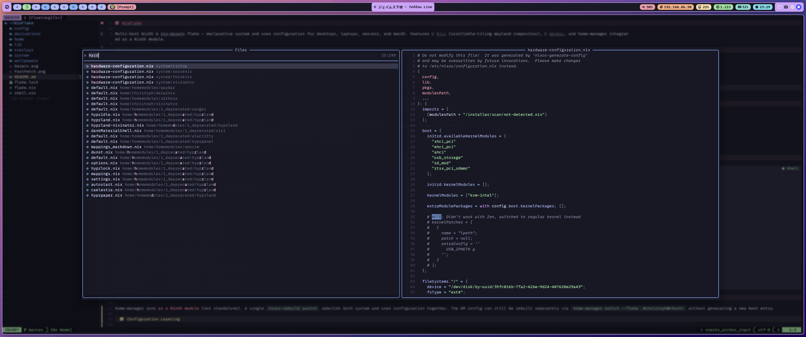
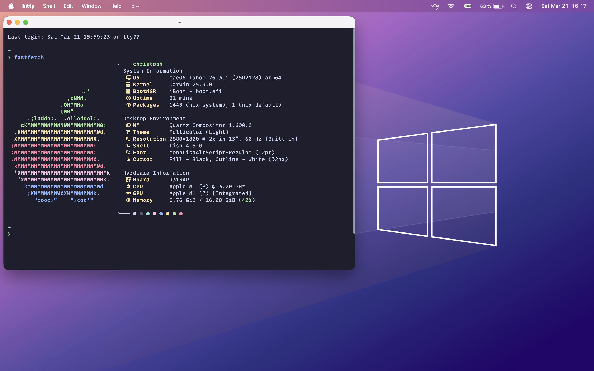

# NixFlake

NixOS flake with [Niri](https://github.com/niri-wm/niri), [Waybar](https://github.com/Alexays/Waybar) for a lightweight desktop and [home-manager](https://github.com/nix-community/home-manager) for declarative `~/` configuration.

## Screenshots






## Hosts

| Host | Type | GPU | Features |
|-|-|-|-|
| `nixinator` | Desktop (x86_64) | NVIDIA | [disko](https://github.com/nix-community/disko) partitioning, [lanzaboote](https://github.com/nix-community/lanzaboote) Secure Boot, [impermanence](https://github.com/nix-community/impermanence) opt-in state, [sops-nix](https://github.com/Mic92/sops-nix) secrets |
| `nixtop` | Laptop (x86_64) | Intel | Obsolete trash computer |
| `servenix` | Headless (x86_64) | NVIDIA | Jellyfin, Nextcloud, Gitea, ... |
| `thinknix` | Headless (x86_64) | - | AdGuard DNS, Nginx, ... |
| `darwinix` | macOS (aarch64) | - | nix-darwin with home-manager |

## Usage

```bash
# Enter dev shell (provides helper utilities)
nix develop

# Rebuild system + user config together
nh os switch
nh os boot

# Or with nixos-rebuild
sudo nixos-rebuild switch --flake .#nixinator
```

## Info

Home-manager runs as a NixOS module (not standalone). A single `nixos-rebuild switch` rebuilds both system and user configuration together.

### Components

Per-host config consists of three layers:

1. **Common Config**: `system/default.nix` (NixOS) / `home/christoph/default.nix` (home-manager)
2. **Host Config**: `system/<hostname>/default.nix` (NixOS) / `home/christoph/<hostname>/default.nix` (home-manager)
3. **Hardware**: `system/<hostname>/hardware-configuration.nix`

### Modules

There are two module hierarchies (NixOS and home-manager modules):

```
system/systemmodules/<name>/        home/homemodules/<name>/
- options.nix # declares options    - options.nix # declares options
- default.nix # implementation      - default.nix # implementation
```

## Files

```
NixFlake/
├── flake.nix              # flake entrypoint: inputs, outputs, host definitions
├── flake.lock             # flake lockfile
├── shell.nix              # dev shell (nix develop)
├── system/                # NixOS system configurations
│   ├── default.nix        # global system defaults (all hosts)
│   ├── <hostname>/        # per-host overrides + hardware-config
│   ├── systemmodules/     # reusable system modules
│   └── services/          # OCI container services
├── home/                  # home-manager user configuration
│   └── christoph/
│       ├── default.nix    # global user defaults
│       ├── <hostname>/    # per-host user overrides
│       └── homemodules/   # reusable home-manager modules
├── lib/                   # shared helpers
├── derivations/           # custom packages
├── overlays/              # package overrides
├── config/                # linked dotfiles
└── wallpapers/            # backgrounds
```

## System Modules

| Module | Description |
|--------|-------------|
| `bootloader` | systemd-boot, lanzaboote Secure Boot signing |
| `desktopportal` | xdg-desktop-portal backends (Niri, GTK) |
| `docker` | Docker / podman daemon config |
| `fonts` | System fonts and fontconfig |
| `impermanence` | Opt-in state persistence (wipes `/` on boot) |
| `mime` | MIME type associations |
| `network` | systemd-networkd wired/wireless config |
| `polkit` | Polkit rules for desktop users |
| `sops-nix` | Secrets decryption at boot |

## Home-Manager Modules

### Shell & Terminal
`fish` `terminal` `kitty` `tmux` `paths`

### Editors
`neovim` `vscode` `zed`

### Desktop / WM
`niri` `waybar` `rofi` `color` `fcitx`

### Media
`mpd` `rmpc` `cava` `beets` `jellyfin-tui`

### Browsers
`firefox` `qutebrowser`

### Tools
`git` `ssh` `bat` `btop` `fastfetch` `lazygit` `yazi` `zathura`

## Services

All server services run as OCI containers (podman). Each service is defined in `system/services/<name>.nix`.

| Service | Purpose |
|---------|---------|
| `adguard` | DNS ad blocking |
| `authelia` | SSO |
| `fileflows` | Media processing |
| `gitea` | Git server |
| `immich` | Photo cloud |
| `jellyfin` | Streaming server |
| `kiwix` | Offline mirrors |
| `kopia` | Docker volume backup |
| `nextcloud` | File sync |
| `nginx-proxy-manager` | Reverse proxy with Let's Encrypt |
| `ntfy` | Push notification server |
| `paperless` | Document management |
| `portainer` | Container status monitor |
| `teamspeak` | Voice chat server |
| `tinymediamanager` | Media metadata management |

## Overlays

Package modifications live in `overlays/default.nix`.

## Secrets

Secrets are managed with sops-nix. Public age keys are stored in `flake.nix` under `publicKeys`. Encrypted `.yaml`/`.json` files are referenced via `sops.secrets.<name>`. Decryption happens at activation time.

## Shared Helpers (`lib/`)

| File | Purpose |
|------|---------|
| `nixos.nix` | Host config builders (NixOS + darwin) |
| `modules.nix` | Option helpers |
| `networking.nix` | systemd-networkd config generators |
| `generators.nix` | Lua code generation |
| `containers.nix` | OCI container helpers for services |
| `color.nix` | Color utilities |
| `rofi.nix` | Rofi menu helpers |

Available to all modules as `mylib` (injected via special args).
