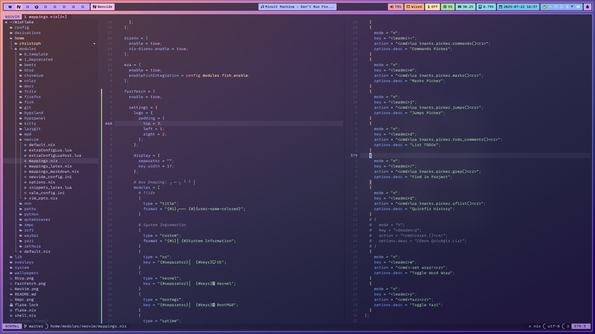

# NixOS Configuration

Modular NixOS configuration, using Hyprland for a lightweight desktop.

To install, run `nixos-rebuild` with the `--flake` parameter from the `NixFlake` directory: `nixos-rebuild switch --flake .#nixinator`.

## NixFlake/system

Contains all the system configurations.

- There is a common configuration used for all systems: `NixFlake/system/default.nix`
- Every system has its own special configuration: `NixFlake/system/<hostname>/default.nix`
- System modules are located in `NixFlake/system/modules`

When creating a NixOS configuration inside the `NixFlake/flake.nix` the common configuration is imported.
Because the hostname is propagated to the common configuration, it can import the host-specific config by itself.

## NixFlake/home

Contains all the home-manager configurations.

- There is a common configuration for each user: `NixFlake/home/<username>/default.nix`
- There is a configuration for a single system of this user: `NixFlake/home/<username>/<hostname>/default.nix`
- Home-Manager modules are located in `NixFlake/home/modules`

When creating a NixOS configuration inside the `NixFlake/flake.nix` the common configuration is imported.
Because the hostname is propagated to the common configuration, it can import the host-specific config by itself.

## NixFlake/derivations

Contains all the stuff I packaged.
Each derivation is loaded into `NixFlake/derivations/default.nix`.

## NixFlake/overlays

Contains (not at the moment) all overlays.
The `NixFlake/overlays/default.nix` imports all of the overlays and all of the derivations.
It is then imported by the toplevel `NixFlake/flake.nix`, to make everything available to the system/home configurations.
